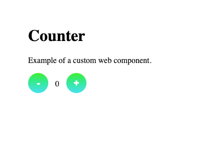

# Counter

An example of a custom counter component in plain JavaScript.

## Counter component files

The counter component is created by extending the built-in HTMLElement class.
The component template and stylesheet are located in the following files:

<pre>
components/do-counter/
  do-counter.js
  do-counter.css
</pre>

(The counter stylesheet file is included in its template in the JS file.)

## Usage

To use this component in HTML, include its markup and a reference to
its JS file:

<pre>
&lt;do-counter count="0">&lt;/do-counter>

&lt;script src="components/do-counter/do-counter.js">&lt;/script>
</pre>
